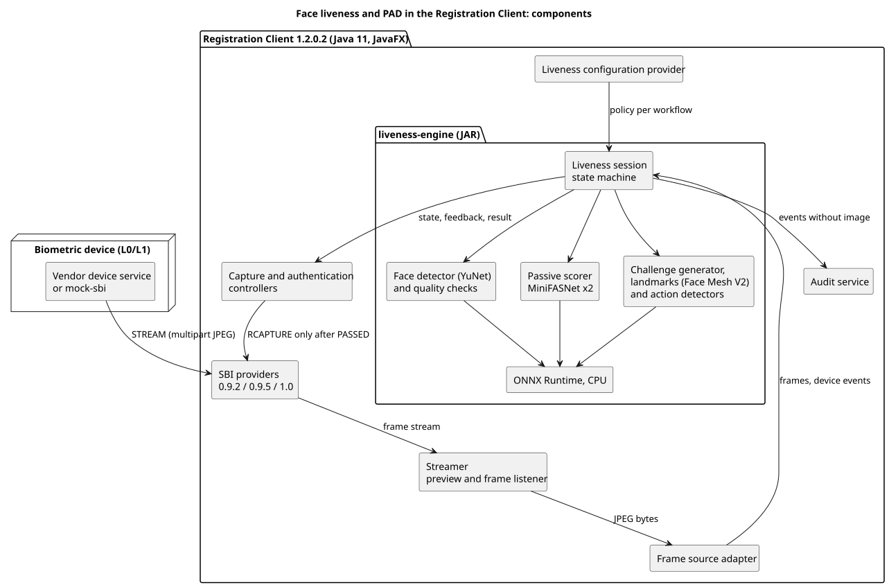

# Architecture

Status on 7 October 2026: design, first version. It describes the target. The existing classes named here were checked in the Registration Client 1.2.0.2 source code. The new components are not implemented yet.

## 1. Context

The solution targets the desktop Registration Client, release 1.2.0.2 (Java 11, JavaFX). Face devices are reached through the MOSIP Secure Biometric Interface (SBI): the client opens a frame stream with the `STREAM` request and asks for the final image with `RCAPTURE`.

Today the client shows the stream as a preview and starts the capture at the same moment. Nothing checks that the face in front of the device is live. The same holds for face authentication of operators and supervisors.

The goal is to place a liveness and presentation attack detection (PAD) gate between the stream and the capture, in the three workflows, without any network dependency.

## 2. Components

Source: [diagrams/components.puml](diagrams/components.puml)

| Component | Existing or new | Role |
| --- | --- | --- |
| Biometric device, real or simulated | Existing, plus `mock-sbi` | Provides the frame stream and the captured image over SBI |
| SBI providers: `MosipDeviceSpecificationProvider` and its implementations for 0.9.2, 0.9.5 and SBI 1.0 | Existing | Common device abstraction of the client. Keeps the solution independent of the device vendor |
| `Streamer` | Existing, small change | Reads the multipart JPEG stream and updates the preview. An optional listener will receive the JPEG bytes of each frame |
| Frame source adapter | New, in the client | Turns frames and device events (unavailable, disconnected, invalid frame) into inputs for the engine |
| `liveness-engine` | New, separate JAR | Face detection, quality checks, passive score, challenge selection, action detection, session state machine |
| Capture and authentication controllers | Existing, modified | Start a liveness session, show its feedback, allow `RCAPTURE` only after success |
| Liveness configuration provider | New, in the client | Reads the liveness keys through `ApplicationContext`, applies defaults and per-workflow overrides |
| Audit | Existing, extended | Receives liveness events through a listener |

The engine has no dependency on Registration Client classes or on JavaFX. It receives JPEG frames and a policy, and returns a state, a feedback code and a result.

## 3. Frame flow

1. A controller asks the SBI layer for the face stream of the selected device.
2. `Streamer` reads each JPEG frame, displays it and passes its bytes to the listener.
3. The adapter wraps the bytes into a frame with a timestamp and a sequence number, then submits it to the liveness session.
4. The session analyses frames on a single worker thread. A frame that arrives while another one is being analysed is skipped, so the preview never waits for the analysis.
5. After each frame the session returns its state and a feedback code. The controller translates the code into a message on the capture screen.
6. When the session reaches `PASSED`, the controller sends `RCAPTURE`. The captured image is checked again before it is accepted.

## 4. Decision flow

Session states: `INIT`, `PASSIVE_CHECK`, `ACTIVE_CHALLENGE`, `PASSED`, `FAILED`.

1. **Frame filtering.** A frame with no face, several faces or insufficient quality gives guidance to the user and does not count for the score.
2. **Passive check.** Once enough good frames are collected, the passive scores are aggregated into one score `s`, compared with two thresholds:
   - `s` at or above the pass threshold: liveness is established with no user action;
   - `s` at or below the attack threshold: presentation attack, immediate failure;
   - between the two: the active check starts on its own.
3. **Active check.** The session draws the configured number of challenges at random among the enabled types (blink, smile, head turn left, head turn right). For each one it measures a baseline, shows the instruction and expects the action before a timeout. The action must happen after the instruction is shown, which a replayed video cannot anticipate.
4. **Controls during the active check.** The passive score keeps being computed and still triggers a failure below the attack threshold. Losing the face, a second face or an inconsistent jump of the face box also ends the session with a failure.
5. **Check of the captured image.** The image returned by `RCAPTURE` must contain one face, outside the attack zone, consistent in position and size with the last face followed in the stream. This closes the gap between the frames that were verified and the image that is stored or matched.
6. **Retry.** After a failure a new attempt is possible until the configured maximum, then the configured behaviour applies.

The passive classifier and its preprocessing are described in [../training/README.md](../training/README.md). The complete rules, with thresholds, action detection, feedback codes and audit events, are in [decision-flow.md](decision-flow.md).

## 5. Workflows and integration points

| Workflow | Class in `registration-client` | Point of integration |
| --- | --- | --- |
| Resident face capture | `GenericBiometricsController`, `BiometricsController` | Both start `rCaptureTaskService()` and `streamer.startStream(...)` together. For the face modality, the capture will wait for a `PASSED` session |
| Operator login by face | `LoginController` | Starts the face stream. A `PASSED` session will be required before the face is captured and matched |
| Operator and supervisor authentication | `AuthenticationController` | Calls `captureAndValidateFace(userId, true, isReviewer)`. `isReviewer` selects the supervisor policy |
| End of day approval by the supervisor | `EODAuthenticationController` | Calls `captureAndValidateFace(userId, false, false)`, with the supervisor policy |
| Capture and match for authentication | `BaseController.captureAndValidateFace(...)` | Shared entry point, where the captured image check will run |

Other modalities (fingerprints, iris) and the exception photo keep their current behaviour. With liveness disabled by configuration, the client behaves as it does today.

The sequence diagrams of the three workflows, and the change at each step, are in [workflows.md](workflows.md).

## 6. Configuration

Liveness keys use the prefix `mosip.registration.face.liveness.` and follow the existing mechanism: values are synchronised from the server configuration when the client is online, stored locally, and read through `ApplicationContext`. They sit next to the existing face keys such as `mosip.registration.face_threshold` and `mosip.registration.num_of_face_retries`.

The keys cover: enabling liveness, the two passive thresholds, enabling the active check, the minimum number of challenges, the challenge types, the challenge timeout, the maximum number of attempts, the behaviour when attempts are exhausted, and a diagnostic mode.

A workflow can override any key by inserting its name after the prefix, for example `mosip.registration.face.liveness.supervisor.active.min_challenges`. The workflow value wins over the general one. If a key is missing, for instance on a first installation that has never synchronised, the defaults packaged with the engine apply.

## 7. Online and offline operation

Liveness, PAD, challenge selection and action validation run inside the Registration Client process. The models are packaged in the engine JAR. No frame leaves the workstation and no network call is made for a liveness decision, so the behaviour is identical online and offline. Only configuration updates need connectivity, through the client's existing synchronisation.

## 8. Security and privacy

- When a presentation attack is detected, the screen shows a generic message. The reason goes to the audit trail only.
- Logs and audit entries carry codes, durations and the model version. They never carry an image or biometric data.
- Challenges are drawn with `java.security.SecureRandom`.
- The signature validation of SBI responses is left untouched.
- Injection of a forged stream before the client is outside the scope of presentation attack detection. It depends on device integrity, which the signed responses of L1 devices address in part.

## 9. Technology choices

| Topic | Choice | Reason |
| --- | --- | --- |
| Engine language | Java 11, standalone Maven module | Must load in the JVM of Registration Client 1.2.0.2 |
| Inference | ONNX Runtime for Java, CPU | One runtime for all models, which are exported from PyTorch |
| Image processing | Plain Java (`ImageIO`, arrays) | No extra native dependency. The resize must reproduce the reference arithmetic |
| Passive classifier | MiniFASNetV2 and MiniFASNetV1SE, from Silent-Face-Anti-Spoofing (Apache-2.0) | Small pretrained models, about 1.8 MB each |
| Face detector | YuNet `2023mar`, from OpenCV Zoo (MIT), 0.23 MB | Small and fast, gives five keypoints. Its box is turned into a square of the same area before the classifier crop, to match the boxes MiniFASNet was trained with |
| Landmarks for the active check | MediaPipe Face Mesh V2 (Apache-2.0), converted to ONNX, 4.8 MB | 478 points with eye and mouth contours, needed for blink, smile and head turn. Its model card reports similar accuracy across regions and skin tones |
| Simulated device | `mock-sbi` with webcam and replay modes | Development without hardware and repeatable tests |
| Diagrams | PlantUML | Versioned as text |

The comparison behind the detector and landmark choices, the model contracts and the measurements on sample images are in [../training/README.md](../training/README.md). On the reference machine, the three models together take about 50 to 70 ms per frame in Python on CPU.

## 10. Android

The models are exported to ONNX and the engine API does not depend on desktop classes, which keeps a port to the Android Registration Client possible. No Android code is part of the current scope.
