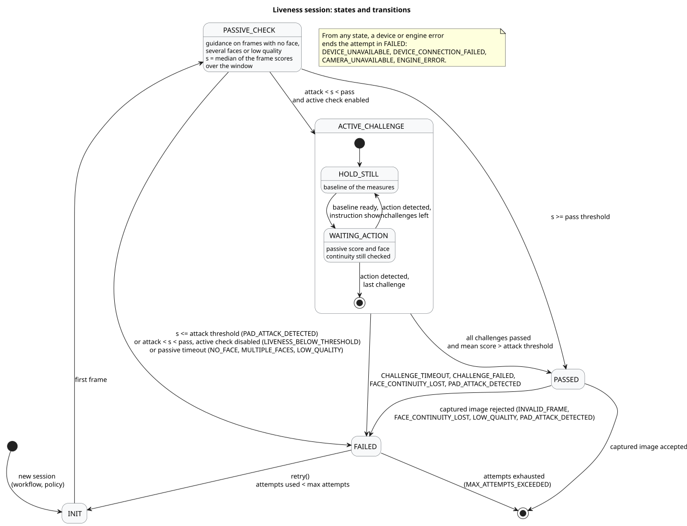
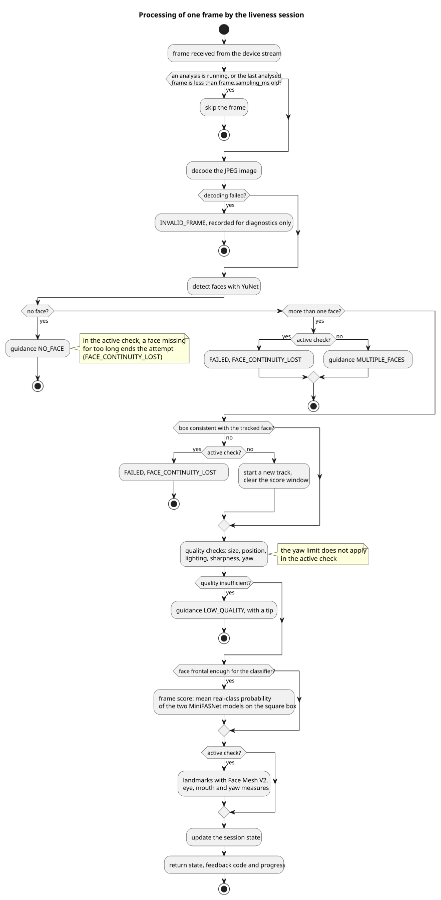

# Decision flow

Status on 7 October 2026: design, first version. This document specifies how a liveness session reaches its decision. It is the reference for the engine issues: preprocessing (#11), detection, quality and passive score (#12), challenges (#13), session state machine (#14) and tests (#15). Thresholds and limits marked "to calibrate" will be set from the team captures (#5 and #7).

Values in this document follow the configuration keys of the project plan, with the prefix `mosip.registration.face.liveness.`. Keys that this document adds are listed in section 10 as proposals.

## 1. Overview

Source: [diagrams/session-states.puml](diagrams/session-states.puml)

| State | Meaning |
| --- | --- |
| `INIT` | The session exists, no frame analysed yet |
| `PASSIVE_CHECK` | Good frames are collected and scored. The user does nothing |
| `ACTIVE_CHALLENGE` | The passive score is ambiguous. The user performs facial actions drawn at random |
| `PASSED` | Liveness is established. The client may request the capture, whose image is checked before it is accepted |
| `FAILED` | The attempt is over, with a reason code. A new attempt is possible until the maximum is reached |

A session serves one face capture of a resident, or one face authentication of an operator or a supervisor. It is created with the workflow (`RESIDENT`, `OPERATOR`, `SUPERVISOR`) and the policy of that workflow, and it holds the attempt counter.

## 2. Inputs

- **Frames.** JPEG images of the device stream, each with a timestamp and a sequence number. The stream comes through the existing SBI layer of the Registration Client.
- **Policy.** The configuration values of the workflow (section 10).
- **Clock.** Injected, so that tests control time. Windows and deadlines use the frame timestamps and the injected clock, never the system clock directly.
- **Device events.** Device unavailable, connection lost, stream interrupted. They come from the frame source adapter of the client.

The engine assumes that frames are not mirrored, as a camera captures them. The preview shown to the user may be mirrored for comfort, but the engine always works on the device frames. This assumption is to be verified with the simulated device (section 11). "Left" and "right" in the challenges refer to the person.

On the sample images, the first YuNet keypoint ("right eye") falls next to the right-eye landmarks of Face Mesh V2: both models name the eyes after the person, and in a non-mirrored image the person's right eye is on the left side of the image.

## 3. Processing of one frame

Source: [diagrams/frame-processing.puml](diagrams/frame-processing.puml)

### 3.1 Sampling

Frames are analysed on one worker thread, so that the preview never waits. A frame is skipped when an analysis is running, or when the last analysed frame is less than `frame.sampling_ms` old (default 100 ms). Skipped frames are not counted anywhere.

### 3.2 Decoding

A frame that cannot be decoded is ignored and counted as `INVALID_FRAME` for diagnostics. It does not change the state.

### 3.3 Face detection

Faces are detected with YuNet (score threshold 0.9, suppression overlap 0.3), as specified in [training/README.md](../training/README.md).

| Result | Passive check | Active check |
| --- | --- | --- |
| No face | Guidance `NO_FACE` | Guidance `NO_FACE`. If no face is seen for more than 1 000 ms, the attempt fails with `FACE_CONTINUITY_LOST` |
| More than one face | Guidance `MULTIPLE_FACES` | The attempt fails with `FACE_CONTINUITY_LOST` |
| One face | Continue | Continue |

### 3.4 Face continuity

The session follows one face from frame to frame. The box of the face is consistent with the tracked face when the overlap (intersection over union) between the two boxes is at least 0.3. At 100 ms between analysed frames, a head turn keeps the overlap well above that value.

- In the passive check, an inconsistent box starts a new track and clears the score window. This is not a failure: a person may sit down or move closer.
- In the active check, an inconsistent box ends the attempt with `FACE_CONTINUITY_LOST`. It prevents a face from being swapped in the middle of a challenge.

### 3.5 Quality checks

A frame that fails a check gives guidance and does not count for the score.

| Check | Rule | Default | Feedback |
| --- | --- | --- | --- |
| Face size | Shorter side of the face box at least `quality.min_face_px` pixels of the source image | 120 | `LOW_QUALITY`, tip "keep your face inside the frame" |
| Position | Face box entirely inside the image | none | `LOW_QUALITY`, tip "keep your face inside the frame" |
| Lighting | Mean grey level of the face region between a lower and an upper bound | to calibrate | `LOW_QUALITY`, tip "improve the lighting" |
| Sharpness | Variance of the Laplacian of the face region, resized to a fixed size, above a bound | to calibrate | `LOW_QUALITY`, tip "hold still" |
| Yaw | Estimated yaw at most `quality.max_yaw_deg`, passive check only | 20 | `LOW_QUALITY`, tip "look directly at the camera" |

The yaw used here comes from the five YuNet keypoints, so that the passive check needs no landmark model. With `r` the horizontal position of the nose tip between the two eyes (0.5 when facing the camera), a simple head model gives `r - 0.5 ≈ (d / D) × tan(yaw)`, where `D` is the distance between the eyes and `d` the depth of the nose tip in front of them. With `d / D` around 0.3, 20 degrees corresponds to `|r - 0.5|` of about 0.11. The factor is to calibrate.

In the active check, the yaw limit does not apply, since a head turn is requested. Frames beyond the limit are still used to detect the action, but they do not receive a passive score (section 3.6).

### 3.6 Frame score

The score of a frame is the mean probability of the real class over the two MiniFASNet models, computed on the square box of the same area as the YuNet box. It lies between 0 and 1. On the sample images of the reference project, it is 0.028 and 0.022 for two photos of a face and 0.996 for a live face.

A frame receives a score only if it passed the quality checks and its yaw is within `quality.max_yaw_deg`. The classifier was not trained on profiles.

## 4. Passive check

The session keeps the scored frames of the current track whose timestamp is within the last `passive.window_ms` (default 3 000 ms). As soon as this window holds at least `passive.min_frames` frames (default 5), the session computes the aggregate score `s`, the median of their scores, and decides:

| Aggregate score | Decision |
| --- | --- |
| `s >= passive.threshold.pass` (default 0.85) | `PASSED`, subject to the check of the captured image |
| `s <= passive.threshold.attack` (default 0.30) | `FAILED`, reason `PAD_ATTACK_DETECTED` |
| Between the two, active check enabled (`active.enabled`, default true) | `ACTIVE_CHALLENGE` |
| Between the two, active check disabled | `FAILED`, reason `LIVENESS_BELOW_THRESHOLD` |

The median makes the decision robust to a single badly scored frame. With the defaults, a decision needs at least half a second of good frames.

The two thresholds are provisional. They will be calibrated on the team captures (#7) and validated by the coordinator before they are written as defaults.

If no decision is reached within `passive.timeout_ms` after the first frame (proposed key, default 20 000 ms), the attempt fails with the guidance code given most often during that time: `NO_FACE`, `MULTIPLE_FACES` or `LOW_QUALITY`.

## 5. Active check

### 5.1 Drawing the challenges

The session draws `active.min_challenges` challenges (default 2) among the types listed in `active.challenge_types` (default `BLINK, SMILE, TURN_LEFT, TURN_RIGHT`), with `java.security.SecureRandom`. The same type never appears twice in a row, unless only one type is enabled. Each attempt draws a new sequence. Tests inject a seeded generator.

The sequence cannot be known in advance, so a replayed video cannot perform the right actions in the right order.

### 5.2 Phases of one challenge

1. **Hold still.** The screen shows "Hold still". The session collects at least 3 good frames over `active.baseline_ms` (proposed key, default 600 ms) and takes the median of each measure as the baseline.
2. **Instruction.** The screen shows the instruction, for example "Please blink". The deadline is set to the display time plus `active.challenge_timeout_ms` (default 8 000 ms).
3. **Detection.** The action must be observed after the instruction is shown and before the deadline. While it is not, the screen shows "Please continue". When it is, the screen shows "Action detected" and the next challenge starts at step 1.

The hold-still phase counts towards the timeout of the challenge. An action already in progress before the instruction, such as a smile held from the start, raises the baseline and is therefore not counted.

### 5.3 Action rules

Measures come from the Face Mesh V2 landmarks (`training/liveness/face_mesh.py`). Every rule compares the measure with the baseline of the challenge. The factors below are starting values, to calibrate on the team captures (#5).

| Challenge | Measure | Detected when | Fails with `CHALLENGE_FAILED` when |
| --- | --- | --- | --- |
| `BLINK` | Mean eye aspect ratio of both eyes | It drops to at most 0.6 × baseline, then rises back to at least 0.85 × baseline | none |
| `SMILE` | Distance between the mouth corners divided by the face width | It reaches at least 1.10 × baseline on 2 consecutive analysed frames | none |
| `TURN_LEFT` | Position of the nose tip between the cheek edges, 0.5 when facing the camera | It rises to at least baseline + 0.15, then comes back within 0.08 of the baseline | It falls to baseline - 0.15 or lower (turn to the right) |
| `TURN_RIGHT` | Same | It falls to at most baseline - 0.15, then comes back within 0.08 of the baseline | It rises to baseline + 0.15 or higher (turn to the left) |

When a person turns the head to their left, in a non-mirrored image, the nose tip moves towards the left cheek edge and the measure rises. This direction is to be confirmed on frames from the simulated device (#17).

A blink lasts 100 to 400 ms. At 100 ms between analysed frames, it covers one to four frames. `frame.sampling_ms` must therefore stay at 100 ms or below, and the time to analyse one frame must stay below it. On the reference machine, the three models take 50 to 70 ms per frame in Python.

### 5.4 Controls during the active check

- **Passive score.** Frames keep being scored. If the median of the last `passive.min_frames` scores falls to `passive.threshold.attack` or below, the attempt fails with `PAD_ATTACK_DETECTED`.
- **Face continuity.** Rules of sections 3.3 and 3.4.
- **Timeout.** A challenge whose action is not detected before its deadline fails with `CHALLENGE_TIMEOUT`.

### 5.5 Success

The active check succeeds when all challenges are detected and the mean score of the frames scored during the active check is above `passive.threshold.attack`. The session goes to `PASSED`.

## 6. Check of the captured image

The liveness decision is made on the stream, while the stored or matched image comes from `RCAPTURE`. The session therefore checks the captured image before it is accepted. Without this check, a device or an attacker could pass liveness on the stream and return another image to the capture.

After `PASSED`, the session keeps following the face on the stream until the client submits the captured image. The face continuity rules of the active check apply during that time. The captured image is accepted when all the following hold:

1. it decodes;
2. YuNet finds exactly one face in it;
3. the face passes the quality checks of section 3.5, the yaw limit included;
4. its frame score is above `passive.threshold.attack`;
5. its face is consistent with the last face followed on the stream. Stream and capture may have different resolutions, so positions and sizes are compared relative to the image size: the centres are at most 15 % of the image width apart, and the ratio of the box widths is between 0.67 and 1.5.

| Check that fails | Reason |
| --- | --- |
| 1 | `INVALID_FRAME` |
| 2 or 5 | `FACE_CONTINUITY_LOST` |
| 3 | `LOW_QUALITY` |
| 4 | `PAD_ATTACK_DETECTED` |

The engine API of the project plan has no operation for this check. Issue #10 adds one to the session, for example `CaptureCheck checkCapture(FaceFrame captured)`.

Whether the stream keeps running during `RCAPTURE` depends on the device. This is to be verified with the simulated device (#16, #17). If the stream stops, the last face followed before the capture is the reference.

## 7. Attempts and end of session

- An attempt ends in `FAILED` or in `PASSED` with an accepted captured image.
- `retry()` starts a new attempt from `INIT` while the number of attempts used is below `max_attempts` (default 3). The new attempt draws a new challenge sequence and starts with an empty score window.
- Every failure after the first analysed frame counts as an attempt, whatever its reason, device errors included. Otherwise, unplugging the device during a challenge would reset the counter. A device that is unavailable before the first frame does not use an attempt.
- When the attempts are exhausted, `on_max_attempts` applies. With `BLOCK` (default), the session ends with `MAX_ATTEMPTS_EXCEEDED`, and the screen directs the user to the recovery process. The behaviour for residents (block only, or switch to the exception process) is still to be decided by the coordinator.
- When liveness is disabled (`enabled=false`), the client keeps its original behaviour and creates no session.

## 8. Feedback and messages

After each analysed frame, the session returns its state, a feedback code and a progress value between 0 and 1. In the passive check, progress is the number of scored frames in the window divided by `passive.min_frames`. In the active check, it is the number of challenges detected divided by their total. The client turns the feedback code into a message from the message files (keys of the project plan, in English, French and Arabic).

| Situation | Feedback code | Message key |
| --- | --- | --- |
| Passive check in progress | `CHECKING` | `LIVENESS_CHECKING` |
| No face | `NO_FACE` | `LIVENESS_NO_FACE` |
| Several faces | `MULTIPLE_FACES` | `LIVENESS_MULTIPLE_FACES` |
| Face too small or partly outside the image | `LOW_QUALITY` | `LIVENESS_TIP_STAY_IN_FRAME` |
| Lighting out of bounds | `LOW_QUALITY` | `LIVENESS_TIP_LIGHTING` |
| Blurred image | `LOW_QUALITY` | `LIVENESS_HOLD_STILL` |
| Head turned too much, passive check | `LOW_QUALITY` | `LIVENESS_TIP_LOOK_CAMERA` |
| Baseline of a challenge | `HOLD_STILL` | `LIVENESS_HOLD_STILL` |
| Instruction of a challenge | `CHALLENGE` | `LIVENESS_CHALLENGE_BLINK`, `_SMILE`, `_TURN_LEFT`, `_TURN_RIGHT` |
| Action not yet detected | `KEEP_GOING` | `LIVENESS_KEEP_GOING` |
| Action detected | `ACTION_DETECTED` | `LIVENESS_ACTION_DETECTED` |
| Liveness established, capture in progress | `HOLD_STILL` | `LIVENESS_HOLD_STILL` |
| Captured image accepted | `SUCCESS` | `LIVENESS_SUCCESS` |
| Failure with `PAD_ATTACK_DETECTED` or `ENGINE_ERROR` | `FAILED` | `LIVENESS_GENERIC_FAILURE` |
| Failure with `CHALLENGE_TIMEOUT` or `CHALLENGE_FAILED` | `FAILED` | `LIVENESS_FAILED` and `LIVENESS_TIP_FOLLOW_ACTION` |
| Other liveness failures | `FAILED` | `LIVENESS_FAILED`, with the tip of the last guidance |
| Retry possible | `FAILED` | adds `LIVENESS_RETRY_AVAILABLE` with the attempt number and the maximum |
| Attempts exhausted | `MAX_ATTEMPTS_EXCEEDED` | `LIVENESS_MAX_ATTEMPTS` |
| Device error | `DEVICE_ERROR` | `LIVENESS_DEVICE_UNAVAILABLE` |

A detected attack always shows the generic message, identical to the one of an engine error. The screen never tells the user that an attack was suspected. Scores, measures and model data appear on screen only when `diagnostic.enabled` is true.

## 9. Audit events

| Transition | Event |
| --- | --- |
| `INIT` to `PASSIVE_CHECK` | `LIVENESS_SESSION_STARTED` |
| `PASSIVE_CHECK` to `ACTIVE_CHALLENGE` | `LIVENESS_ACTIVE_TRIGGERED` |
| Challenge detected | `LIVENESS_CHALLENGE_PASSED`, with the challenge type |
| Challenge failed | `LIVENESS_CHALLENGE_FAILED`, with the challenge type and the reason |
| Captured image accepted | `LIVENESS_PASSED` |
| Attempt failed | `LIVENESS_FAILED`, with the reason |
| Attempts exhausted | `LIVENESS_MAX_ATTEMPTS` |
| Device error | `LIVENESS_DEVICE_ERROR` |

Every event carries the workflow, the attempt number, the duration and the model set version. No event carries a score or an image. Scores go only to the diagnostic log, and only when `diagnostic.enabled` is true.

## 10. Parameters

### 10.1 Configuration keys of the project plan

| Key | Default | Used in |
| --- | --- | --- |
| `enabled` | `true` | Section 7 |
| `passive.threshold.pass` | `0.85`, to calibrate | Section 4 |
| `passive.threshold.attack` | `0.30`, to calibrate | Sections 4, 5.4, 5.5, 6 |
| `passive.min_frames` | `5` | Sections 4, 5.4 |
| `passive.window_ms` | `3000` | Section 4 |
| `frame.sampling_ms` | `100` | Sections 3.1, 5.3 |
| `quality.min_face_px` | `120` | Section 3.5 |
| `quality.max_yaw_deg` | `20` | Sections 3.5, 3.6 |
| `active.enabled` | `true` | Section 4 |
| `active.min_challenges` | `2` | Section 5.1 |
| `active.challenge_types` | `BLINK,SMILE,TURN_LEFT,TURN_RIGHT` | Section 5.1 |
| `active.challenge_timeout_ms` | `8000` | Section 5.2 |
| `max_attempts` | `3` | Section 7 |
| `on_max_attempts` | `BLOCK` | Section 7 |
| `diagnostic.enabled` | `false` | Sections 8, 9 |

Any key can be overridden for one workflow by inserting the workflow name after the prefix, for example `mosip.registration.face.liveness.supervisor.active.min_challenges=3`.

### 10.2 Keys proposed by this document

| Key | Default | Purpose |
| --- | --- | --- |
| `passive.timeout_ms` | `20000` | End an attempt that never reaches a passive decision (section 4) |
| `active.baseline_ms` | `600` | Duration of the hold-still phase of a challenge (section 5.2) |

### 10.3 Engine constants

These values are fixed in the engine for now. They can become configuration keys if the calibration shows the need.

| Constant | Value | Section |
| --- | --- | --- |
| YuNet score threshold, suppression overlap | 0.9, 0.3 | 3.3 |
| Longest time without a face in the active check | 1 000 ms | 3.3 |
| Minimum overlap with the tracked face | 0.3 | 3.4 |
| Lighting and sharpness bounds | to calibrate | 3.5 |
| Minimum number of baseline frames | 3 | 5.2 |
| Blink factors | 0.6 and 0.85 of the baseline | 5.3 |
| Smile factor | 1.10 of the baseline, 2 frames | 5.3 |
| Head turn amplitude and return margin | 0.15 and 0.08 | 5.3 |
| Captured image consistency | centres within 15 % of the image width, width ratio between 0.67 and 1.5 | 6 |

## 11. Points to confirm

1. The two proposed keys of section 10.2.
2. The attempt counting rule of section 7: device errors after the first frame use an attempt.
3. The capture check operation in the engine API (#10).
4. On frames of the simulated device (#16, #17): that they are not mirrored, the direction of the head-turn measure, and whether the stream keeps running during `RCAPTURE`.
5. Lighting, sharpness and yaw bounds, action factors and passive thresholds, from the team captures (#5, #7).
6. The behaviour for residents when attempts are exhausted.
