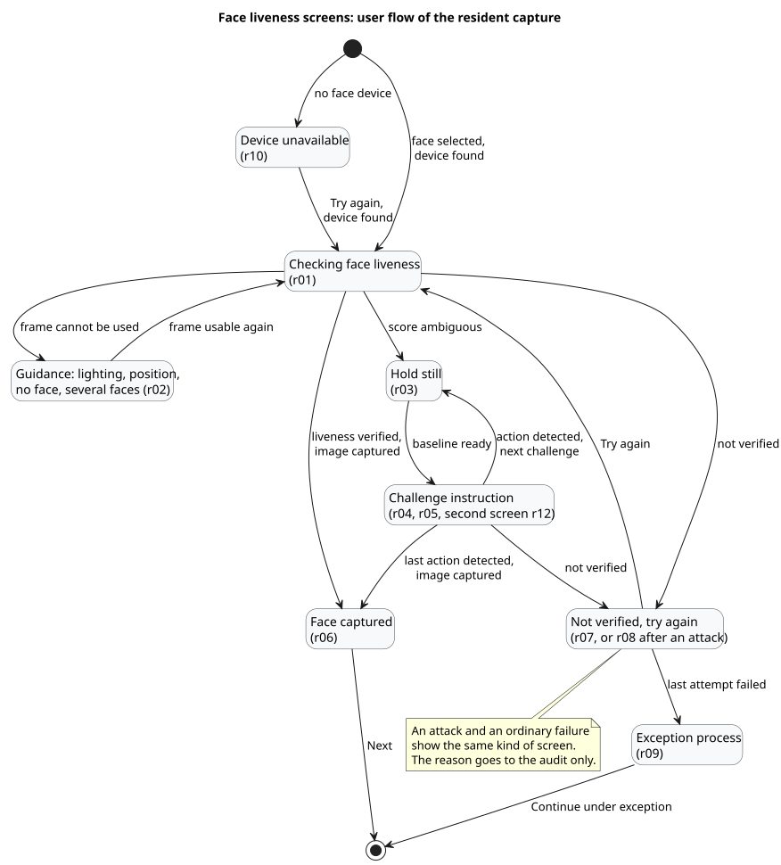
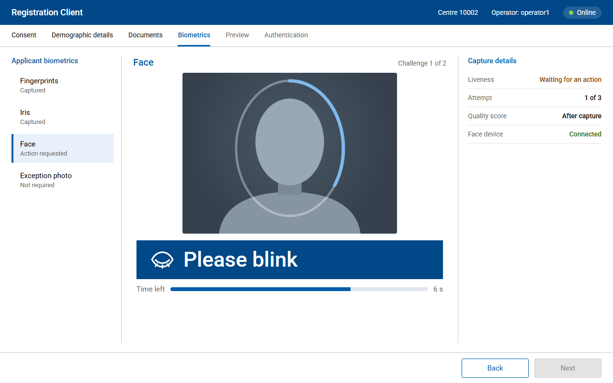
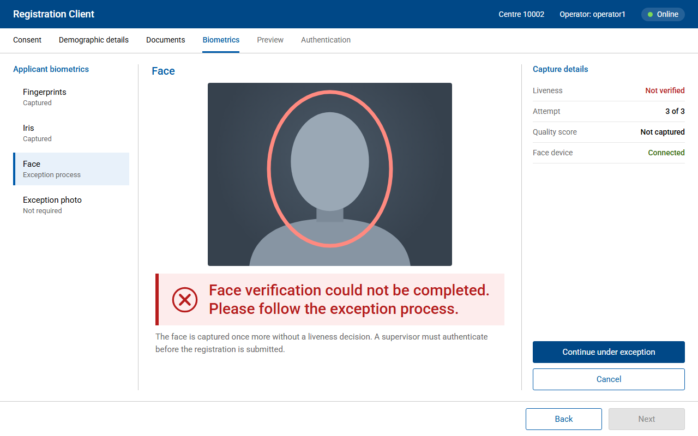
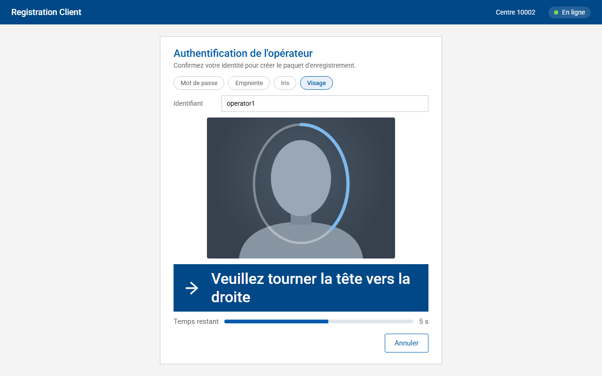

# Screen mock-ups

Mock-ups of the face liveness screens of the Registration Client, for the resident face capture and for operator and supervisor authentication. They are the reference for the screen changes of #24 and illustrate [../decision-flow.md](../decision-flow.md) and [../workflows.md](../workflows.md).

The face in the preview is a drawn silhouette. No image of a real person is used.

## User flow



Source: [../diagrams/ui-flow.puml](../diagrams/ui-flow.puml)

## Screens

### Resident face capture

| Screen | State | Message key |
| --- | --- | --- |
| [r01](r01-checking.png) | Passive check in progress | `LIVENESS_CHECKING` |
| [r02](r02-guidance-lighting.png) | Frame that cannot be used, with a tip | `LIVENESS_TIP_LIGHTING`, `LIVENESS_TIP_FACE_VISIBLE` |
| [r03](r03-hold-still.png) | Baseline before the instruction of a challenge | `LIVENESS_HOLD_STILL` |
| [r04](r04-challenge-blink.png) | First challenge, with the time left | `LIVENESS_CHALLENGE_BLINK` |
| [r05](r05-challenge-turn.png) | Second challenge, the first one detected | `LIVENESS_CHALLENGE_TURN_LEFT` |
| [r06](r06-success.png) | Liveness verified, face captured, `Next` enabled | `LIVENESS_SUCCESS` |
| [r07](r07-failed-retry.png) | Liveness not verified, new attempt possible, tips | `LIVENESS_FAILED`, `LIVENESS_RETRY_AVAILABLE`, tips |
| [r08](r08-attack-generic.png) | Attack detected: generic message, nothing about the attack | `LIVENESS_GENERIC_FAILURE`, `LIVENESS_RETRY_AVAILABLE` |
| [r09](r09-max-attempts-exception.png) | Attempts exhausted: exception process | `LIVENESS_MAX_ATTEMPTS` |
| [r10](r10-device-unavailable.png) | Face device not found | `LIVENESS_DEVICE_UNAVAILABLE` |
| [r11](r11-diagnostic.png) | Diagnostic mode, offline: scores shown for troubleshooting | `LIVENESS_CHECKING` |
| [r12](r12-resident-screen-fr.png) | Second screen turned towards the resident, in French | `LIVENESS_CHALLENGE_BLINK` |





### Operator and supervisor authentication

| Screen | State | Message key |
| --- | --- | --- |
| [a01](a01-operator-login.png) | Operator sign-in, offline, passive check | `LIVENESS_CHECKING` |
| [a02](a02-operator-challenge-fr.png) | Operator authentication of a packet, challenge, in French | `LIVENESS_CHALLENGE_TURN_RIGHT` |
| [a03](a03-supervisor-approval.png) | Supervisor authentication for the end of day approval, challenge | `LIVENESS_CHALLENGE_SMILE` |
| [a04](a04-max-attempts-auth.png) | Sign-in attempts exhausted: no exception, another sign-in method | `LIVENESS_MAX_ATTEMPTS_AUTH` |



## Design rules

- **The client's look.** Roboto, the blues of the client stylesheet (`#005BAA` for titles and outlined buttons, `#004887` for the bar and the main buttons), its greys and borders. The liveness elements sit in the existing biometric screen: list of modalities, preview, capture details, `Back` and `Next`.
- **One prominent element.** The instruction of a challenge appears in a dark blue band, 44 px on the capture screen, so that a resident sitting in front of the camera can read it. On a second screen turned towards the resident, it reaches 76 px. Everything else stays quiet.
- **The positioning oval shows progress.** It fills while frames are analysed, turns green when liveness is verified, amber for guidance and red for a failure.
- **Text with every colour and icon.** Each state has a message and a status in the capture details (`Checking`, `Waiting for an action`, `Verified`, `Not verified`). Colour and icon only repeat what the text says.
- **No model data on screen.** Scores and states appear only in diagnostic mode (r11), enabled by configuration and framed as such.
- **An attack does not show as an attack.** r08 uses the generic message, which is also the message of an engine error. The reason is written to the audit trail only.
- **Automatic progress.** No button starts the liveness check or the capture. The only buttons are for what the person decides: try again, continue under exception, capture again, sign in another way.
- **Same vocabulary from button to message.** "Try again" in the message and on the button, "exception process" in the message and "Continue under exception" on the button.

### Contrast

Measured with the WCAG 2 formula on the colours of the mock-ups:

| Text | Ratio |
| --- | --- |
| Instruction band, white on dark blue | 9.2:1 |
| Checking band, dark blue on light blue | 8.1:1 |
| Guidance band, amber on light amber | 6.6:1 |
| Failure band, red on light red | 5.8:1 |
| Success band, green on light green | 5.8:1 |
| Secondary text, grey on white | 5.7:1 |
| Titles, blue on white | 6.8:1 |

The client stylesheet uses `#FF0000` and `#45A30A` for errors and success. As text on white they reach 4.0:1 and 3.2:1, below the 4.5:1 of WCAG level AA. The mock-ups keep them for the oval and the borders, and use darker shades for text.

### Languages

Messages come from the message files of the client (`messages_en.properties`, `messages_fr.properties`, `messages_ar.properties`), with the keys of the project plan and the added key `LIVENESS_MAX_ATTEMPTS_AUTH`. a02 and r12 show the French texts. The layout leaves room for longer French sentences: the instruction band wraps on two lines without losing its size.

## Regenerating the images

The screens are written in [mockups.html](mockups.html). Opened in a browser without parameter, the page shows all screens. `?screen=<id>` shows one screen at 1280 x 800.

```powershell
python docs/ui/render_mockups.py --chrome "C:/Program Files/Google/Chrome/Application/chrome.exe"
```

The script runs Chrome in headless mode with a temporary profile and writes one PNG per screen in this folder.
