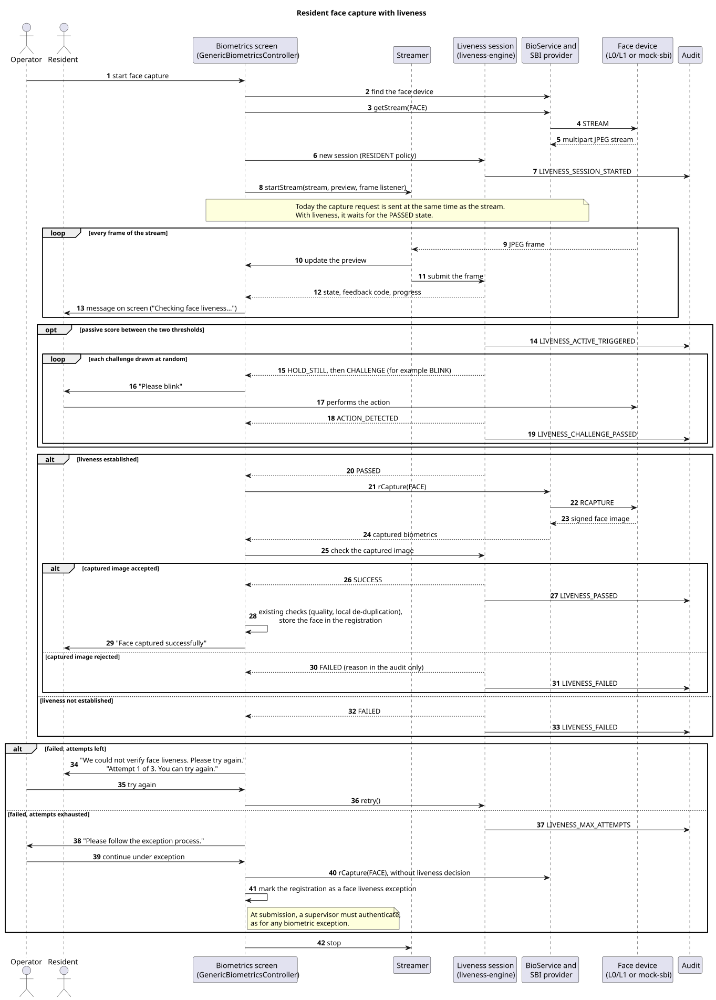
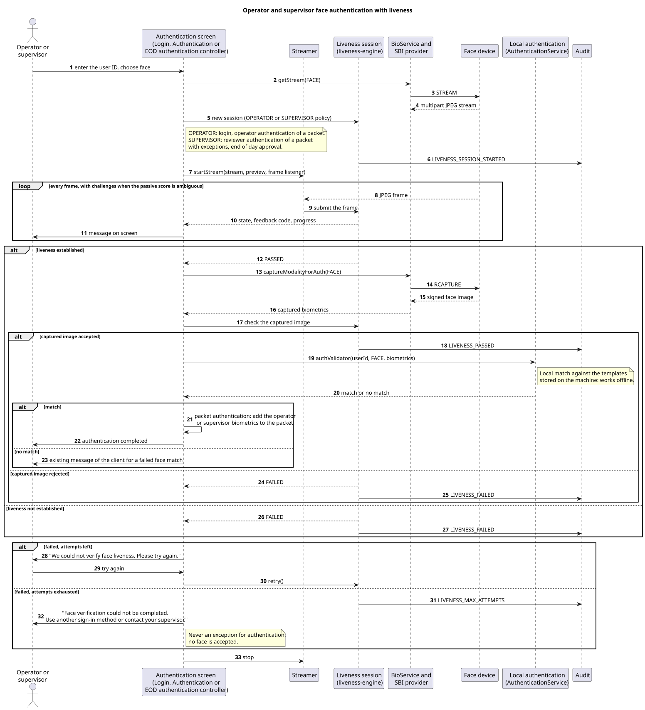

# Workflows

Status on 7 October 2026: design, first version. This document shows how liveness fits into the three face workflows of Registration Client 1.2.0.2: resident face capture, operator authentication and supervisor authentication. It completes [architecture.md](architecture.md), which lists the integration points, and [decision-flow.md](decision-flow.md), which specifies the rules of a liveness session. It is the reference for the integration issues #20 to #26.

Class names and line numbers refer to the `feature/face-liveness` branch of the team's `registration-client` fork, identical to release 1.2.0.2 on 7 October 2026.

## 1. Resident face capture

Source: [diagrams/sequence-resident.puml](diagrams/sequence-resident.puml)

### 1.1 Today

The registration screen uses `GenericBiometricsController` (`GenericBiometricFXML.fxml`). `BiometricsController` (`Biometrics.fxml`) contains the same sequence. For the face, after the device search:

1. `bioService.getStream(...)` opens the stream (line 480);
2. `rCaptureTaskService()` sends the capture request (line 491);
3. `streamer.startStream(...)` displays the stream (line 492).

The capture request leaves at the same time as the stream. When the device returns the image, the client checks its quality (`isValidBiometric`), looks for a duplicate among the local records (`identifyInLocalGallery`), counts the attempt and stores the face in the registration.

### 1.2 With liveness

| Step | Change |
| --- | --- |
| Before the stream | Create a liveness session with the `RESIDENT` policy, if liveness is enabled |
| Stream | Start the stream with a frame listener that submits each frame to the session. The preview keeps working as before |
| Capture request | Call `rCaptureTaskService()` only when the session reaches `PASSED`, instead of at the start of the stream |
| Captured image | Submit the image returned by `RCAPTURE` to the session for the check of section 6 of the decision flow, before the existing quality and duplicate checks |
| Failure | Show the message of the feedback code. Offer a new attempt while attempts are left |
| Last attempt failed | Offer the exception process: one capture without liveness decision, liveness exception mark, supervisor authentication at submission (decision flow, section 7.1) |

The existing attempt counter of the registration (`ATTEMPTS`, used for the number of retries recorded with each biometric) is not the liveness attempt counter. A liveness attempt that ends before `RCAPTURE` sends no capture request, so it does not change the existing counter.

Other modalities (fingerprints, iris) and the exception photo keep their current sequence.

## 2. Operator and supervisor authentication

Source: [diagrams/sequence-authentication.puml](diagrams/sequence-authentication.puml)

### 2.1 Entry points

| Situation | Controller | Policy |
| --- | --- | --- |
| Operator login by face | `LoginController` (`RegistrationLogin.fxml`), `streamFace()` then `captureFace()` | `OPERATOR` |
| Operator authentication before a packet is created | `AuthenticationController` (`OperatorAuthentication.fxml`), `isReviewer` false | `OPERATOR` |
| Supervisor authentication of a packet with biometric exceptions | `AuthenticationController`, `isReviewer` true | `SUPERVISOR` |
| End of day approval | `EODAuthenticationController` (`Authentication.fxml`) | `SUPERVISOR` |

### 2.2 Today

The screen starts the face stream. When the user asks for the scan, the controller captures the face with `bioService.captureModalityForAuth(...)` and compares it with the templates of that user stored on the machine (`authenticationService.authValidator(...)`). For a packet, the matched biometrics are added to the packet as officer or supervisor biometrics. `AuthenticationController` and `EODAuthenticationController` do this in `BaseController.captureAndValidateFace(...)` (line 1713). The login screen goes through `SessionContext.create(...)` in `registration-services`, which captures and compares in the same way.

### 2.3 With liveness

| Step | Change |
| --- | --- |
| Stream | Create a liveness session with the policy of the table above, and submit each frame to it |
| Capture | Start the capture when the session reaches `PASSED`. The user no longer needs to press the scan button: the subject asks that the workflow proceed on its own once liveness is established |
| Captured image | Check it with the session between the capture and the comparison. In `captureAndValidateFace(...)`, this sits between `captureModalityForAuth(...)` and `authValidator(...)`. For the login, the check needs a hook in `SessionContext.create(...)` or a capture done by the controller before it |
| Comparison | Unchanged. A face that is live but does not match keeps the existing message of the client |
| Last attempt failed | Block. No exception path for authentication |

Liveness comes before the comparison: an attacker learns nothing about whether a photo would have matched.

## 3. Online and offline

Liveness runs inside the client process, the face comparison for authentication uses the templates stored on the machine, and the audit events go through the existing audit service of the client, which writes them locally. None of these sequences needs the network. Only configuration updates do, through the existing synchronisation.

## 4. Who reads the instructions

In a registration centre, the screen usually faces the operator, not the resident. The active challenges ask the resident to act within a few seconds. Two options, to choose in #24:

- the operator reads the instruction aloud. The challenge timeout (`active.challenge_timeout_ms`, 8 seconds) leaves time for it;
- the client shows the instruction in a large font that can be read from the resident's seat, or on a second screen turned towards the resident when the centre has one.

For operator and supervisor authentication, the person in front of the camera also reads the screen, so the question does not arise.

## 5. Points to confirm

1. With the simulated device: the stream keeps running while `RCAPTURE` is in progress, so that the session can follow the face until the capture (#16, #17).
2. For the login: where to place the captured image check, in `SessionContext.create(...)` or in `LoginController` (#23).
3. How the instructions reach the resident (#24).
